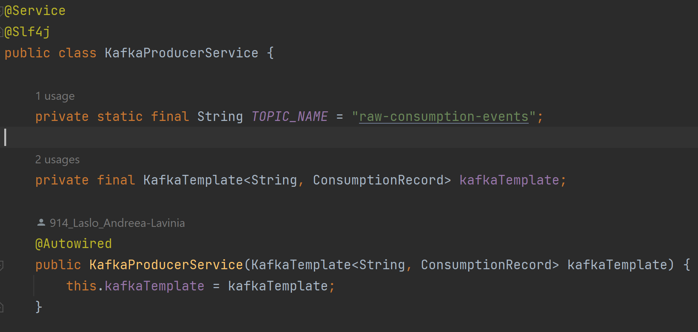

# **Deep Dive: Apache Kafka in Sustainable Energy Optimization Platform**

This tutorial explores the implementation of **Apache Kafka** as the event-streaming service of the platform. In this architecture, Kafka serves as the asynchronous bridge between data ingestion (Billing Service) and recommendation generation (Recommendation Service).

## **Kafka's role in the platform**
In a traditional synchronous system, the Billing Service would call the Recommendation Service via a REST API. If the Recommendation Service was slow or down, the user's data ingestion would fail.

**By using Kafka, we achieve:**
- **Decoupling**: The Billing Service doesn't care if the Recommendation Service is busy; it just "emits" the event.
- **Reliability**: Events are stored in the Kafka cluster until the consumer is ready to process them.
- **Ordering**: By using the *propertyId* as the message key, consumption ingestions for the same address are processed in the exact order they occurred.

## **Kafka Topic**
Platform uses one **Kafka Topic** named: `raw-consumption-events`.
A topic as a high-speed, persistent log file:
- **Producer (Billing)**: Appends a new event to the end of the log.
- **Consumer (Recommendation)**: Reads from the log at its own pace, keeping track of its "offset" (the last message it read).

## **Project Dependencies**
To enable Kafka in Spring Boot, I added the following dependency in both the billing-service and recommendation-service pom.xml files.
```
<dependency>
    <groupId>org.springframework.kafka</groupId>
    <artifactId>spring-kafka</artifactId>
</dependency>
```

## **KafkaProducerService class: Billing Service**
The **KafkaProducerService** class is responsible for taking a ConsumptionRecord and publishing it to the Kafka cluster.  

### **Kafka Template**
The core engine for sending data is the **KafkaTemplate**.
- KafkaTemplate is a high-level abstraction provided by Spring Kafka. It wraps the low-level Kafka Producer API and provides a simplified way to execute Kafka operations.
- It is thread-safe, meaning a single instance can be shared across the entire billing-service.
- When .send() is called, it doesn't wait for the message to reach the server. Instead, it returns a CompletableFuture. This allows the BillingController to finish its task quickly while the message travels to the broker in the background.
- I use the overload send(topic, key, value). By passing the propertyId as the key, KafkaTemplate ensures that all readings for a specific property are sent to the same partition, guaranteeing they are processed in chronological order.



### **Implementation**
- **Keying**: Send propertyId as the Kafka Key.
- **Results**: Used .whenComplete() to log whether the message successfully reached the broker or if an error occurred.

## **KafkaConsumerService class: Recommendation Service**
The **KafkaConsumerService** class is the "listener" that waits for new messages to appear on the topic. 

### **Automatic Triggering via @KafkaListener**
A critical aspect of the **consumeConsumptionEvent** function is that it is automatically triggered by Spring.
- The @KafkaListener annotation tells Spring Boot to automatically subscribe this service to the raw-consumption-events topic as soon as the application starts.
- Behind the scenes, Spring maintains a continuous "polling" loop that asks the Kafka broker for new data.
- When a message arrives, Spring automatically deserializes the JSON into a ConsumptionEvent object and immediately calls the annotated method.

### **Implementation**
- **Consuming**: Automatically triggered by @KafkaListener when new data reaches the broker.
- **FaaS Integration**: Sends the raw kWh to a Python-based Carbon Calculator function (OpenFaaS) to get a carbon score.
- **RabbitMQ connection**: If usage is too high (hardcoded value by me), it switches communication protocols and sends a "RED Alert" message to RabbitMQ.
- **Database persistence**: Saves the final recommendation to the PostgreSQL database.


## **Summary of the Data Flow**

1. **UI**: User submits consumption.
2. **Billing API**: Saves to DB $\rightarrow$ sends to Kafka Topic using KafkaTemplate.
3. **Kafka Broker**: Buffers the message in a partition based on the key.
4. **Recommendation Listener**: Detects new message $\rightarrow$ calls FaaS $\rightarrow$ saves recommendation.
5. **Alerting Path**: If high usage is detected $\rightarrow$ RabbitMQ $\rightarrow$ WebSocket $\rightarrow$ UI alert displayed to the user.
